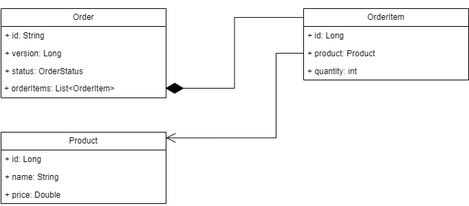

Приложение представляет собой модель REST-сервиса заказов.

Инструкция по установке приложения.
Предпроверки

Убедитесь, что:
1. nginx-ingress установлен и включен в кластере.
2. доменное имя arch.homework роутится на хост, на котором установлен minikube.
3. пути:
     - http://arch.homework/order-service/*
   не используются другими сервисами.

Создаем и делаем дефолтным namespace learning

```
kubectl create ns learning

kubectl config set-context --current --namespace=learning

```

переходим в директорию helm-charts и через helm устанавливаем чарты для БД Postgres, и сервиса работы с заказами:

```
helm install postgres ./postgres

helm install order ./order 
```

Удостоверьтесь, что все необходимые чарты установлены.


Описание приложения.

UML модель data классов:


Статусная модель заказа:


Описание методов:
(SwaggerUI доступен по адресу http://arch.homework/order-service/order-doc/swagger-ui/#)

- GET /order/get: получение статуса заказа. Идемпотентный метод. Обязательный параметр orderId (номер заказа)
- POST /order/place: создание заказа. Идемпотентный, генерация Id выполняется на стороне клиента, если заказ создается в БД один раз, в последующем метод возвращает текущее состояние заказа.
- PUT /order/adjust: изменение заказа. Доступен для заказов в статусе NEW, идемпотентный (при условии, что статус заказа не изменен другими методами). Для заказов в другом статусе возвращает ошибку.
- PUT /order/process: передача заказа в обработку (статус меняется на IN_PROGRESS вне зависимости от того, какой указан в запросе). Доступен для заказов в статусе NEW, для заказов в статусе IN_PROGRESS, COMPLETED возвращает текущее состояние объекта, для заказов в статусе CANCELED - ошибку.
- PUT /order/cancel: отмена заказа (статус меняется на CANCELED вне зависимости от того, какой указан в запросе). Доступен для заказов в статусе NEW, IN_PROGRESS. Для заказов в статусе CANCELED возвращает текущее состояние объекта, для объекта в статусе COMPLETED - ошибку. 
Все методы (кроме GET) используют оптимистическую блокировку изменяемого объекта и должны передавать текущую версию состояния объекта (можно получить ее, запросив GET /order/get).
В случае неактуальной версии или отсутствия версии в переданном теле запроса будет возвращен 409/CONFLICT с соотвтетсвующим комментарием в коде ответа.
Если заказ не найден в БД, то все методы кроме POST /order/place возвращают 404/NOT FOUND c соотвтетсвующим комментарием в коде ответа.

Также доступны методы для редактирования справочника продуктов:

- GET /product/get: Получение продукта. Обязательный параметр productId (номер продукта)
- PUT /product/post: Создание/изменение продукта. Идемпотентный метод.
- DELETE /product/delete: Удаление продукта из спраочника.


Инструкция по тестированию:
тестовая коллекция находится в каталоге postman/

Описание тест-кейсов:

- POST create product beer
- GET product beer
- POST create product fish
- GET product fish
- POST create product chips
- GET product chips - создание и проверка наличия товарных позиций в справочнике продуктов для последующих тестов


- POST try to create order without id - попытка создать заказ без orderId (получаем 409/CONFLICT)
- POST create order - создание заказа
- POST create the same order again - попытка повторного создания заказа - получаем состояние уже созданного объекта
- GET get order - получаем текущее состояние заказа
- PUT add orderItem for order - добавляем товар в заказ
- PUT add the same orderItem for order - добавляем товар в заказ повторно (с актуальной версией) - объект не изменился (кроме версии)
- GET get order again - получаем текущее состояние заказа
- PUT try to process order without version - попытка передать заказ в обработку без версии (получаем 409/CONFLICT)
- PUT try to process order with old version - попытка передать заказ в обработку со старой версией (получаем 409/CONFLICT)
- PUT process order - передача заказа в обработку 
- PUT process order again - повторная передача заказа в обработку - просто получаем состояние объекта
- PUT try to cancel processed order - попытка отменить выполненный заказ (получаем 409/CONFLICT)

- POST create order2 - создание еще одного заказа (заказ2)
- PUT add orderItem for order2 - добавляем товар в заказ2
- GET get order2 - получаем текущее состояние заказа2
- PUT try to cancel order2 with old version - попытка отменить заказ со старой версией (получаем 409/CONFLICT)
- PUT cancel order2 - отмена заказа2 
- PUT cancel order2 again - повторная отмена заказа2 - просто получаем текущее состояние объекта
- GET get order2 again - получаем текущее состояние заказа2
- PUT try to process canceled order2 - попытка передать отмененный заказ2 в обработку (получаем 409/CONFLICT)

